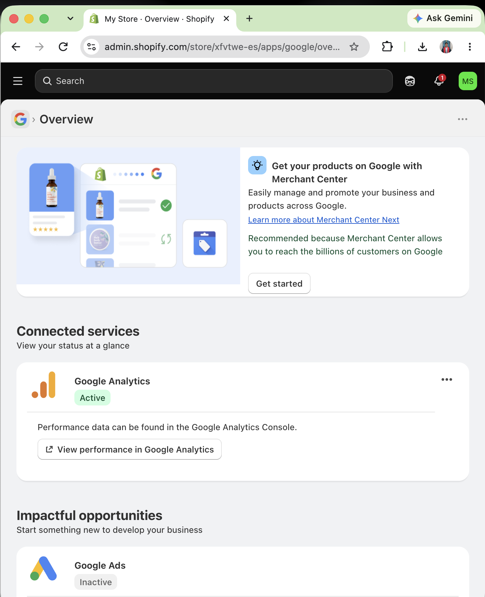
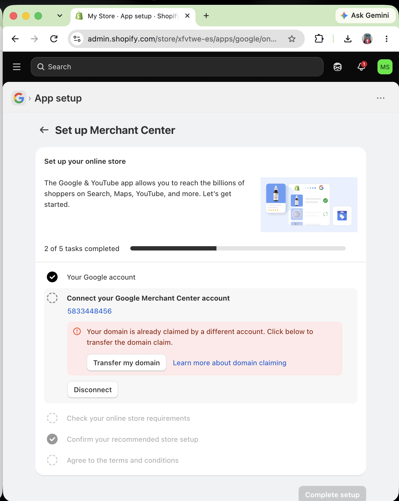
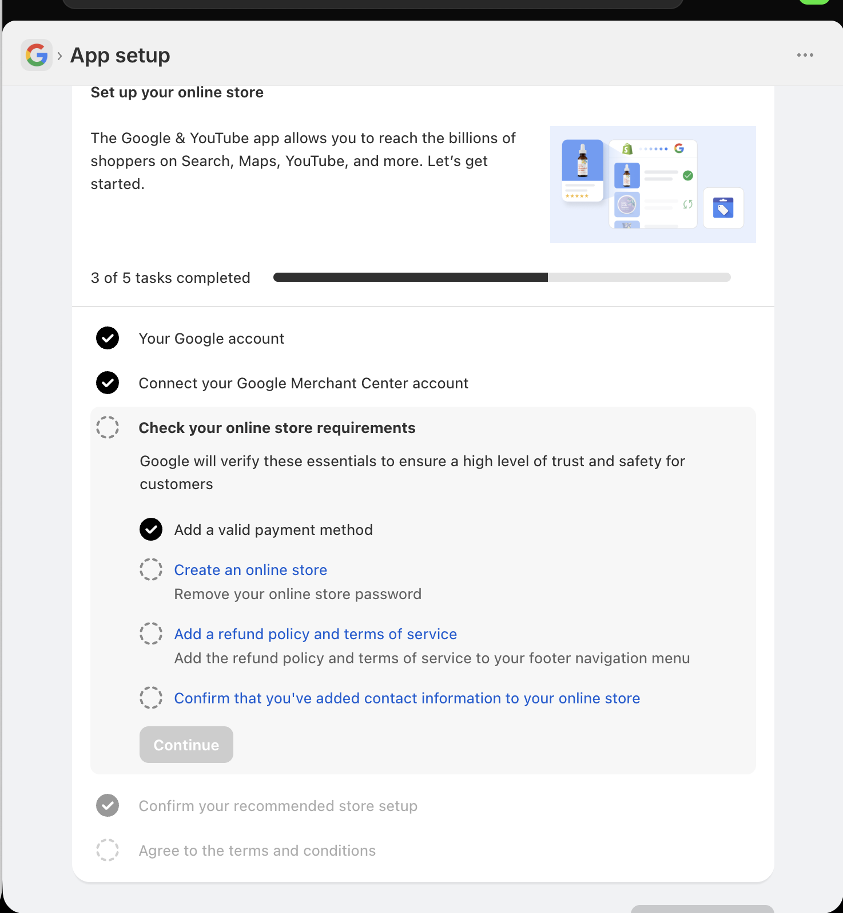
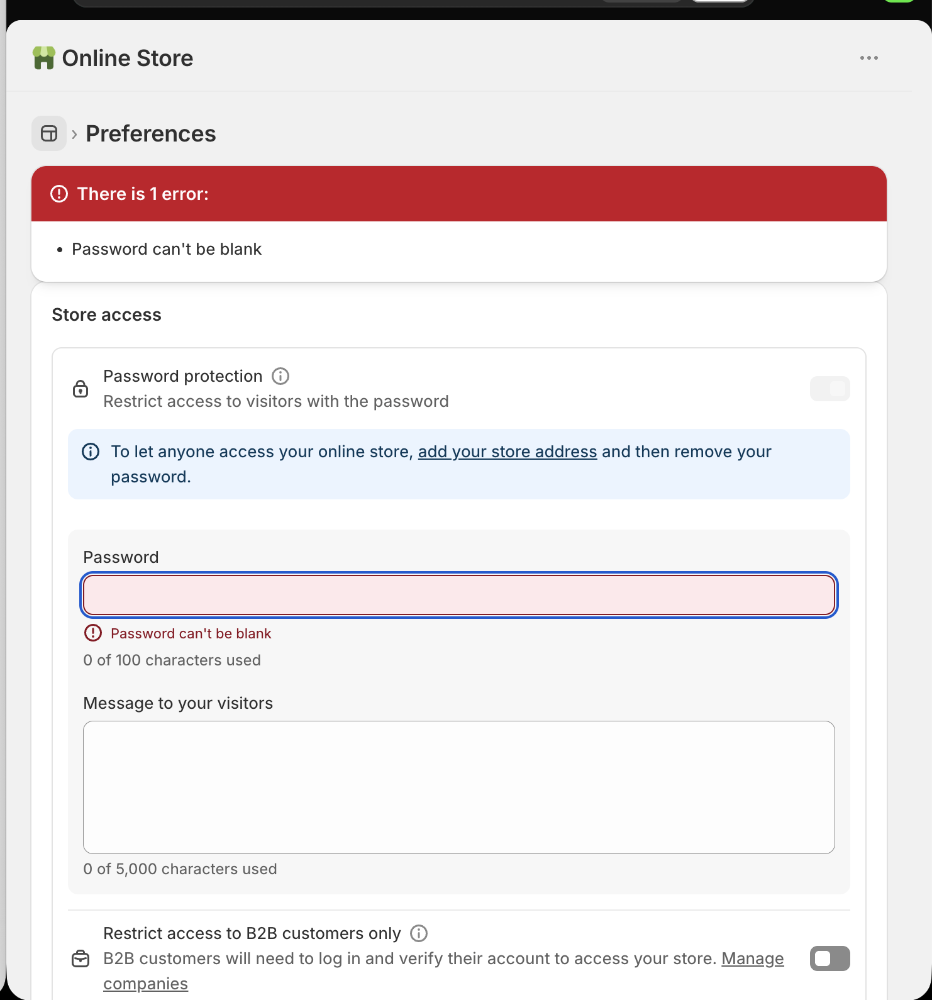
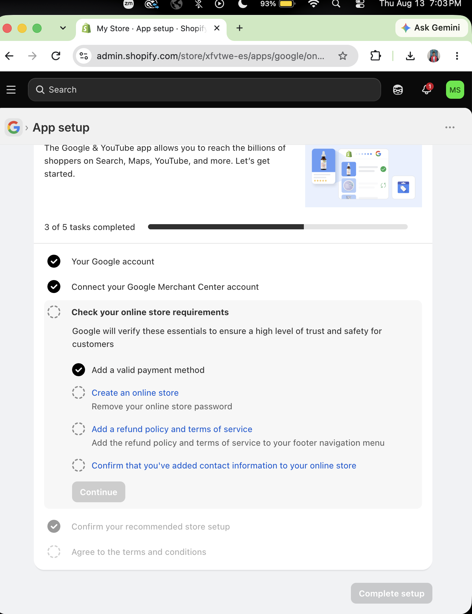

# Shopify to Google Merchant Center Connection Lab

# Introduction

For this assignment, I used my Shopify practice store to attempt a connection with Google Merchant Center through Shopify's Google & YouTube sales channel. The purpose of this activity was to understand how Shopify product information can connect to Google Merchant Center and to identify the requirements that must be completed before products can become eligible for Google Shopping listings or advertisements.

My Shopify practice store contains several product pages with product titles, descriptions, images, prices, and availability. I also previously connected Google Analytics to the Shopify store. Because this store was created for classroom practice and is not an official operating business, I did not want to misrepresent the store as a real business during the Google Merchant Center setup process.

# Connection Attempt Evidence

## Google & YouTube Sales Channel

I began the connection process by opening the Google & YouTube sales channel from my Shopify admin dashboard. The overview page showed that Google Analytics was already active while Google Ads was inactive. It also provided an option to begin setting up Google Merchant Center so that Shopify products could eventually be displayed across Google.

## Screenshot 1: Google & YouTube Sales Channel Overview

This screen confirmed that the Google & YouTube sales channel was already installed and that Merchant Center setup was available for the Shopify store.

# Google Merchant Center Setup

After selecting **Get started**, I entered the Merchant Center setup process. My Google account was already connected, and Shopify attempted to connect the store to a Google Merchant Center account.

During this step, I encountered a domain claim warning. Shopify indicated that the store domain had already been claimed by a different Google Merchant Center account.

## Screenshot 2: Merchant Center Domain Claim Warning

The warning stated that the domain was already claimed by another account and provided an option to transfer the domain claim. I selected the transfer option in order to continue the setup process.

After transferring the domain claim, Shopify successfully recognized the connected Google Merchant Center account and allowed me to continue to the online store requirements.

# Product Sync or Product Listing Evidence

I was not able to reach the final product synchronization or product listing stage during this attempt. Before Shopify could allow the products to move forward to Google Merchant Center, additional online store requirements had to be completed.

The Merchant Center setup showed that my Google account and Merchant Center account were connected. However, Google still required the online store to meet several trust and safety requirements before the setup could continue.

## Screenshot 3: Online Store Requirements

The setup page showed that a valid payment method had already been added. However, several requirements were still incomplete:

- The online store needed to be publicly accessible.
- The storefront password needed to be removed.
- A refund policy and terms of service needed to be added.
- Contact information needed to be confirmed on the online store.

Because these requirements were incomplete, the **Continue** button remained unavailable.

As a result, I was not able to reach the final product synchronization stage. Therefore, my Shopify products were not fully synced or submitted for approval through Google Merchant Center during this assignment.

# Setup Barriers and Warnings

## Domain Claim Issue

One of the first barriers I encountered was a domain claim conflict. Shopify indicated that the store domain had already been claimed by another Google Merchant Center account.

This demonstrated the importance of having one clearly managed Merchant Center account associated with a retailer's website. A real business would need to determine which Google account currently owns the domain and make sure the correct Merchant Center account controls it.

In my case, I used the available domain transfer option and was able to move past this warning.

# Public Online Store Requirement

Another major barrier was the requirement to make the Shopify store publicly accessible. Google Merchant Center requires customers and Google to be able to access the online store without a password.

When I attempted to remove the storefront password, Shopify required a valid business address before the online store could be opened to the public.

## Screenshot 4: Shopify Business Address Requirement

Because this Shopify store is only a classroom practice store, I chose not to use CPP Farm Store's real business address. Doing so could incorrectly represent my practice store as an official CPP Farm Store website.

For this reason, I stopped the process instead of entering business information that did not belong to the practice store.

# Missing Refund Policy and Terms of Service

Google Merchant Center also identified the refund policy and terms of service as incomplete requirements.

These policies are important because customers should understand the conditions associated with purchases, returns, refunds, and use of the website before placing an order.

A real retailer should create accurate policies and make them easy to find, especially in the footer navigation.

# Contact Information Requirement

Google also required confirmation that customer contact information was available on the website.

A legitimate retailer should provide customers with a clear method of contacting the business if they have questions about products, orders, returns, refunds, or other issues.

# Final Connection Status

After reviewing the remaining requirements, I chose not to continue with the setup because Shopify required the practice store to become publicly accessible. Removing the storefront password required additional business information, including a business address. Because this was a classroom practice store and not an official CPP Farm Store website, I did not want to enter CPP Farm Store's business information or misrepresent the practice store as a real operating business.

## Screenshot 5: Final Merchant Center Setup Status

At the end of my connection attempt, my Google account and Google Merchant Center account were successfully connected. A valid payment method was also recognized. However, the online store requirements were still incomplete.

The store remained password-protected, the refund policy and terms of service still needed to be added, and contact information still needed to be confirmed. Because these requirements were incomplete, the **Continue** button remained unavailable.

Therefore, I was unable to proceed to the final product synchronization or product listing stage. This stopping point demonstrated how Google Merchant Center evaluates overall store readiness before allowing a retailer to move forward with product listings.

# Fixes Needed

Before this Shopify store could realistically complete the Google Merchant Center connection and become eligible for Google Shopping, several areas would need to be addressed.

# 1. Provide Accurate Business Information

The retailer would need to provide an accurate business name, address, contact information, and other identifying information.

The information should represent the actual retailer operating the website.

For this classroom practice assignment, I did not use CPP Farm Store's real business address because the Shopify store is not an official CPP Farm Store website.

# 2. Make the Online Store Public

The Shopify storefront password would need to be removed so Google and potential customers could access the website.

A publicly accessible website is important because Google needs to review the store and verify that product landing pages function correctly.

# 3. Add a Refund Policy

A complete refund and return policy should be created and clearly displayed on the Shopify website.

The policy should explain return eligibility, deadlines, refund procedures, and any customer responsibilities.

# 4. Add Terms of Service

The store should provide terms of service that explain the conditions customers agree to when using the website and purchasing products.

These terms help establish transparency and credibility.

# 5. Provide Contact Information

The online store should contain accurate customer contact information or a dedicated Contact page.

Customers should have an easy way to contact the retailer if they experience a problem with an order, payment, return, or product.

# 6. Review Product Data

Before syncing products with Google Merchant Center, the retailer should review the entire Shopify catalog.

Important product information should include:

- Accurate product titles
- Detailed product descriptions
- High-quality product images
- Current prices
- Accurate availability
- Appropriate product categories
- Consistent product information between Shopify and Google Merchant Center

# 7. Resolve Merchant Center Account Ownership

A retailer should make sure that the website domain is connected to the correct Google Merchant Center account before beginning the integration.

This would help prevent domain claim conflicts similar to the one I experienced during my setup attempt.

# 8. Review the Website Before Advertising

Before running Google Shopping Ads, the retailer should review the complete customer experience.

The website should be easy to navigate, product pages should be complete, policies should be clearly available, and customers should understand shipping, returns, and contact options.

# CPP Farm Store Reflection

Based on my experience attempting to connect Shopify to Google Merchant Center, CPP Farm Store should prepare both its ecommerce website and product catalog carefully before launching Google Shopping Ads. The setup process showed me that Google evaluates more than just whether products exist in Shopify. The retailer also needs to demonstrate that the online store is legitimate, publicly accessible, trustworthy, and prepared to serve customers.

One of the most important areas CPP Farm Store should prepare is its business and website information. The store should have accurate contact information, a verified website domain, clear store information, and consistent ownership between Shopify and Google Merchant Center. My setup attempt showed how a domain already connected to another Merchant Center account can create an immediate barrier. CPP Farm Store should make sure the correct organizational Google account controls its Merchant Center account and website domain before beginning the integration.

CPP Farm Store should also develop clear refund, return, shipping, and terms-of-service information. Google identified these customer-facing elements as important parts of online store readiness. These policies would also improve customer confidence when purchasing CPP products online.

Product data quality would be another major priority. Product titles, descriptions, prices, availability, categories, and images should be accurate and consistent. Strong product photography would be especially important because Google Shopping is highly visual. Products such as produce, gift baskets, food products, and CPP merchandise should have clear images that accurately represent what customers will receive.

Finally, CPP Farm Store should review its entire customer journey before advertising. Google Shopping Ads could generate additional website traffic, but advertising should begin only after the website, policies, product information, checkout experience, and fulfillment process are ready. My experience demonstrated that Merchant Center readiness is not only an advertising task; it requires coordination between ecommerce operations, product merchandising, customer service, and digital marketing.

# Conclusion

This assignment demonstrated the process and requirements involved in connecting a Shopify store to Google Merchant Center.

Although I did not complete the final product synchronization process, I successfully connected my Google account and Google Merchant Center account and identified several important barriers.

The main barriers included the initial domain claim conflict, the requirement to make the online store publicly accessible, the business address requirement, incomplete refund and terms-of-service information, and the need to confirm customer contact information.

The experience showed that Google Merchant Center requires retailers to have a complete and trustworthy ecommerce environment before products can be promoted through Google Shopping.

For a real retailer such as CPP Farm Store, preparing accurate business information, store policies, customer contact information, product data, website access, and Merchant Center account ownership would be essential before launching Google Shopping Ads.

# Appendix

## GitHub Pages

[View Published Report](<https://kebachez.github.io/OACP-W06-Google-Merchant-Center/>)

## GitHub Repository

[View GitHub Repository](<https://github.com/kebachez/OACP-W06-Google-Merchant-Center.git>)